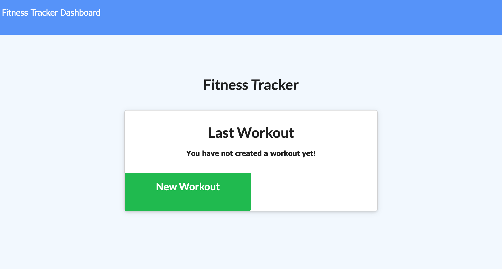
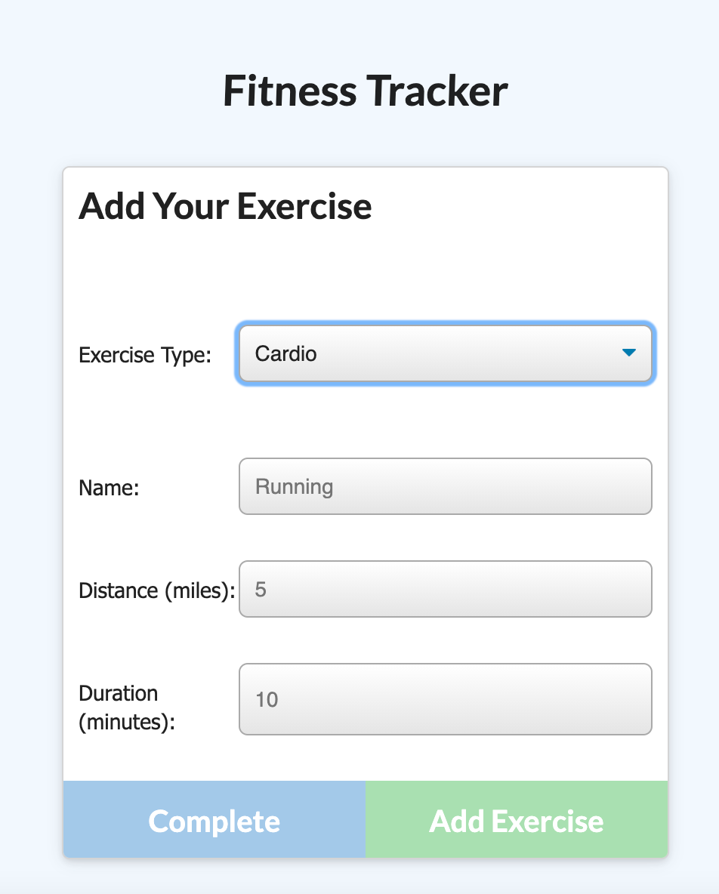

# MongoDb Workout-Tracker

## Technologies

The Workout Tracker utilizes mongoDB, express.js, JavaScript, HTML5, and CSS.

## Functionality

This app allows users to view, create, and track their daily workouts. Multiple exercised can be logged within a workout. Stats are provided for users to track progress and monitor their overall productivity.

## Application Link

Heroku:

